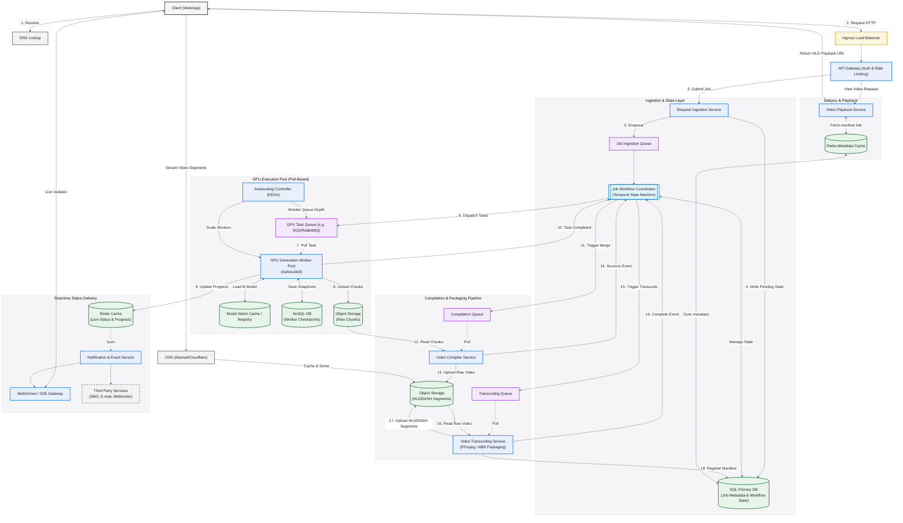

# Video AI Generation System Design

## 1. Overview

This document outlines the system design for a scalable and resilient video AI generation system. The system allows customers to submit requests for video generation, which are processed asynchronously. The design emphasizes fault tolerance, performance, and cost-effectiveness.

## 2. Requirements

* **Functional:**
    * Customers should be able to submit AI video generation requests.
    * Customers should be able to track the status of their jobs.
    * The system should be resilient to failures.
* Out of Scope:
  * Real-time Video Editing
  * Live Video Streaming
  * Custom AI Model Upload
  * Direct Social Media Posting
  * User Management System
  * Support for multiple video formats (abstracted as something spooky)
* **Non-Functional:**
    * Scalability: The system should handle a large number of concurrent requests.
    * Reliability: The system should minimize data loss and ensure job completion.
    * Performance: The system should provide a responsive user experience.
    * Cost-effectiveness: The system should optimize resource utilization.
* Out of Scope:
  * On-Premise Deployment
  * Security Compliance
  * Adjusting video quality resolution for customer device (abstracted as something spooky)

## 3. Components

### Ingress
* **API Gateway**
  * Authenticates requests and enforces rate limits
  * Routes job submission to the Ingestion layer and video view requests to the Playback layer

### Ingestion & State Layer
* **Request Ingestion Service**
  * Validates and persists incoming job requests to the SQL Primary DB
  * Enqueues a job task to the Job Ingestion Queue
* **SQL Primary DB**
  * Single source of truth for job metadata and workflow state across all pipeline stages
* **Job Ingestion Queue**
  * Decouples the HTTP request path from the orchestration layer
* **Job Workflow Coordinator (Temporal State Machine)**
  * Manages the full job lifecycle: Created → Generating → Compiling → Transcoding → Ready
  * Dispatches tasks to downstream queues and handles retries on stage failure

### GPU Execution Pool (Pull-Based)
* **GPU Task Queue**
  * Buffers pending generation tasks; workers pull when GPU capacity is available
  * Enables SQS-style visibility timeout for automatic retry on worker crash
* **GPU Generation Worker Pool**
  * Autoscaled pool of GPU instances that pull tasks and run the generative AI model
  * Streams output chunks to Object Storage and emits progress events to Redis
* **Autoscaling Controller (KEDA)**
  * Monitors GPU Task Queue depth and scales the worker pool up or down accordingly
* **Model Warm Cache / Registry**
  * Stores pre-loaded AI model weights to eliminate cold-start latency on new worker instances
* **NoSQL DB (Worker Checkpoints)**
  * Persists in-progress generation snapshots so interrupted jobs can resume from the last checkpoint
* **Object Storage (Raw Chunks)**
  * Stores raw video chunks produced by the generation workers

### Compilation & Packaging Pipeline
* **Compilation Queue**
  * Buffers compile jobs; triggered by the Coordinator once all generation chunks are confirmed
* **Video Compiler Service**
  * Pulls chunk lists from Object Storage and merges them into a single contiguous video file
* **Transcoding Queue**
  * Buffers transcode jobs; triggered by the Coordinator once compilation succeeds
* **Video Transcoding Service (FFmpeg / ABR Packaging)**
  * Transcodes the compiled video into multi-bitrate HLS/DASH adaptive streaming segments
  * Registers the output manifest URL in the SQL Primary DB on completion
* **Object Storage (HLS/DASH Segments)**
  * Stores the final adaptive bitrate video segments and manifests served to the CDN

### Real-time Status Delivery
* **Redis Cache (Live Status & Progress)**
  * Holds per-job progress state written by GPU workers; fan-out source for the Notification Service
* **Notification & Event Service**
  * Consumes status events from Redis and fans out to the WebSocket gateway and third-party channels
* **WebSocket / SSE Gateway**
  * Maintains persistent connections with clients and pushes real-time job progress updates
* **Third Party Services (SMS, E-mail, Webhooks)**
  * External notification channels for job completion or failure alerts

### Delivery & Playback
* **Video Playback Service**
  * Resolves the HLS manifest URL for a completed job and returns it to the client
* **Redis Metadata Cache**
  * Caches manifest URLs and job completion metadata to reduce SQL read load on playback requests
* **CDN (Akamai/Cloudflare)**
  * Caches and serves HLS/DASH segment files at the edge for low-latency global video streaming

## 4. System Design Diagram

