# Video AI Generation System Design

## 1. Overview

This document outlines the system design for a scalable and resilient video AI generation system. The system allows customers to submit requests for video generation, which are processed asynchronously. The design emphasizes fault tolerance, performance, and cost-effectiveness.

## 2. Requirements

* **Functional:**
    * Customers should be able to submit AI video generation requests.
    * Customers should be able to track the status of their jobs.
    * The system should be resilient to failures.
* Out of Scope:
  * Real-time Video Editing
  * Live Video Streaming
  * Custom AI Model Upload
  * Direct Social Media Posting
  * User Management System
  * Support for multiple video formats (abstracted as something spooky)
* **Non-Functional:**
    * Scalability: The system should handle a large number of concurrent requests.
    * Reliability: The system should minimize data loss and ensure job completion.
    * Performance: The system should provide a responsive user experience.
    * Cost-effectiveness: The system should optimize resource utilization.
* Out of Scope:
  * On-Premise Deployment
  * Security Compliance
  * Adjusting video quality resolution for customer device (abstracted as something spooky)

## 3. Components
* Request Handler
  * Enqueues requests for generating videos to the message queue
* Job Processing Service
  * Orchestrates spinning up jobs to produce videos and manages the job lifecycle
  * Retains the job status
* Video Generation Service
  * The specialized hardware instances that run generative AI models to generate videos
* Video Compiler Service
  * Assembles video chunks from object storage into media files that can be downloaded
  * Subscribed to Pub/Sub Topic
* Video Playback Service
  * Retrieves the viewable video files from Object Storage and other complex system components for supporting video that are out of scope
* Notification Service
  * Responsible for pushing notifications to third-party customer channels

## 4. System Design Diagram

```mermaid
%%{
  init: {
    "theme": "base",
    "themeVariables": {
      "background": "#ffffff",
      "primaryColor": "#e8f0fe",
      "primaryTextColor": "#1d1d1f",
      "primaryBorderColor": "#1a73e8",
      "lineColor": "#5f6368",
      "secondaryColor": "#f3e8fd",
      "tertiaryColor": "#f5f5f7",
      "edgeLabelBackground": "#ffffff"
    }
  }
}%%
flowchart TD
    %% Styling Classes with explicit dark text colors for high readability
    classDef client fill:#f5f5f7,stroke:#1d1d1f,stroke-width:2px,color:#1d1d1f;
    classDef lb fill:#fef7e0,stroke:#f9ab00,stroke-width:2px,color:#1d1d1f;
    classDef gateway fill:#e8f0fe,stroke:#1a73e8,stroke-width:2px,color:#1d1d1f;
    classDef service fill:#e8f0fe,stroke:#1a73e8,stroke-width:2px,color:#1d1d1f;
    classDef queue fill:#f3e8fd,stroke:#a142f4,stroke-width:2px,color:#1d1d1f;
    classDef database fill:#e6f4ea,stroke:#137333,stroke-width:2px,color:#1d1d1f;
    classDef external fill:#f1f3f4,stroke:#5f6368,stroke-width:2px,color:#1d1d1f;
    classDef thirdparty fill:#f1f3f4,stroke:#5f6368,stroke-width:2px,stroke-dasharray: 5 5,color:#1d1d1f;
    classDef cloud fill:#fce8e6,stroke:#ea4335,stroke-width:2px,color:#1d1d1f;
    classDef orchestrator fill:#e1f5fe,stroke:#0288d1,stroke-width:2px,color:#1d1d1f;

    %% Node Definitions
    Client["Client (Web/App)"]:::client
    DNS["DNS Lookup"]:::external
    CDN["CDN (Akamai/Cloudflare)"]:::external
    LB_Ingress["Ingress Load Balancer"]:::lb
    APIGW["API Gateway (Auth & Rate Limiting)"]:::gateway

    subgraph Ingestion_Layer["Ingestion & State Layer"]
        ReqHandler["Request Ingestion Service"]:::service
        JobDb[("SQL Primary DB<br/>(Job Metadata & Workflow State)")]:::database
        JobQueue["Job Ingestion Queue"]:::queue
        Coordinator[["Job Workflow Coordinator<br/>(Temporal State Machine)"]]:::orchestrator
    end

    subgraph GPU_Generation_Layer["GPU Execution Pool (Pull-Based)"]
        TaskQueue["GPU Task Queue (e.g. SQS/RabbitMQ)"]:::queue
        GenWorker["GPU Generation Worker Pool<br/>(Autoscaled)"]:::service
        Autoscaler["Autoscaling Controller (KEDA)"]:::gateway
        ModelCache[("Model Warm Cache / Registry")]:::database
        NoSQL[("NoSQL DB<br/>(Worker Checkpoints)")]:::database
        ObjStore[("Object Storage<br/>(Raw Chunks & Compiled Video)")]:::database
    end

    subgraph Post_Processing_Layer["Compilation & Packaging Pipeline"]
        CompileQueue["Compilation Queue"]:::queue
        Compiler["Video Compiler Service"]:::service
        TranscodeQueue["Transcoding Queue"]:::queue
        Transcoder["Video Transcoding Service<br/>(FFmpeg / ABR Packaging)"]:::service
    end

    subgraph Notification_Layer["Real-time Status Delivery"]
        RedisStatus[("Redis Cache<br/>(Live Status & Progress)")]:::database
        Notification["Notification & Event Service"]:::service
        WSAgent["WebSocket / SSE Gateway"]:::gateway
        ThirdParty["Third Party Services<br/>(SMS, E-mail, Webhooks)"]:::thirdparty
    end

    subgraph Delivery_Layer["Delivery & Playback"]
        Playback["Video Playback Service"]:::service
        RedisPlayback[("Redis Metadata Cache")]:::database
    end

    %% Client entry
    Client -->|1. Resolve| DNS
    Client -->|2. Request HTTP| LB_Ingress
    LB_Ingress --> APIGW
    Client <-->|Live Updates| WSAgent

    %% Ingestion Flow
    APIGW -->|3. Submit Job| ReqHandler
    ReqHandler -->|4. Write Pending State| JobDb
    ReqHandler -->|5. Enqueue| JobQueue
    JobQueue --> Coordinator
    Coordinator <-->|Manage State| JobDb

    %% Generation Flow
    Coordinator -->|6. Dispatch Tasks| TaskQueue
    TaskQueue -.->|7. Pull Task| GenWorker
    Autoscaler -->|Monitor Queue Depth| TaskQueue
    Autoscaler -->|Scale Workers| GenWorker
    GenWorker <-->|Load AI Model| ModelCache
    GenWorker <-->|Save Snapshots| NoSQL
    GenWorker -->|8. Upload Chunks| ObjStore
    GenWorker -->|9. Update Progress| RedisStatus

    %% Real-time update push
    RedisStatus -.->|Sync| Notification
    Notification --> WSAgent
    Notification --> ThirdParty

    %% Compilation Flow
    GenWorker -->|10. Task Completed| Coordinator
    Coordinator -->|11. Trigger Merge| CompileQueue
    CompileQueue -.->|Pull| Compiler
    ObjStore -->|12. Read Chunks| Compiler
    Compiler -->|13. Upload Raw Video| ObjStore
    Compiler -->|14. Success Event| Coordinator

    %% Transcoding Flow
    Coordinator -->|15. Trigger Transcode| TranscodeQueue
    TranscodeQueue -.->|Pull| Transcoder
    ObjStore -->|16. Read Raw Video| Transcoder
    Transcoder -->|17. Upload HLS/DASH Segments| ObjStore
    Transcoder -->|18. Register Manifest| JobDb
    Transcoder -->|19. Complete Event| Coordinator

    %% Playback Flow
    APIGW -->|View Video Request| Playback
    Playback <-->|Fetch manifest link| RedisPlayback
    RedisPlayback <-->|Sync metadata| JobDb
    Playback -->|Return HLS Playback URL| Client
    Client -->|Stream Video Segments| CDN
    CDN -->|Cache & Serve| ObjStore
```

