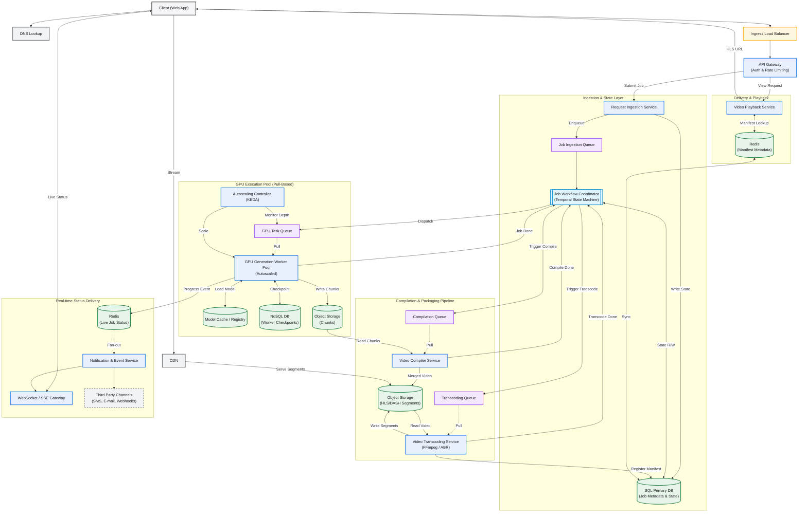

# Video AI Generation System Design

## 1. Overview

This document outlines the system design for a scalable and resilient video AI generation system. The system allows customers to submit requests for video generation, which are processed asynchronously. The design emphasizes fault tolerance, performance, and cost-effectiveness.

## 2. Requirements

* **Functional:**
    * Customers should be able to submit AI video generation requests.
    * Customers should be able to track the status of their jobs.
    * The system should be resilient to failures.
* Out of Scope:
  * Real-time Video Editing
  * Live Video Streaming
  * Custom AI Model Upload
  * Direct Social Media Posting
  * User Management System
  * Support for multiple video formats (abstracted as something spooky)
* **Non-Functional:**
    * Scalability: The system should handle a large number of concurrent requests.
    * Reliability: The system should minimize data loss and ensure job completion.
    * Performance: The system should provide a responsive user experience.
    * Cost-effectiveness: The system should optimize resource utilization.
* Out of Scope:
  * On-Premise Deployment
  * Security Compliance
  * Adjusting video quality resolution for customer device (abstracted as something spooky)

## 3. Components

### Ingress & Gateway Layer
* **DNS & CDN**: Resolves client requests and caches video segment deliveries at the edge.
* **Ingress Load Balancer**: Distributes incoming HTTP and WebSocket traffic across gateway instances.
* **API Gateway**: Handles authentication, rate limiting, and routes requests to downstream services (e.g. video playback vs. job creation).

### Ingestion & State Layer
* **Request Ingestion Service**: Receives video generation requests, writes initial job metadata, and places them into the job ingestion queue.
* **SQL Primary DB**: The primary system of record for job metadata, customer settings, and durable workflow state.
* **Job Ingestion Queue**: Decouples incoming requests from down-stream execution nodes.
* **Job Workflow Coordinator**: A Temporal-style orchestrator managing the multi-stage pipeline state machine (Created -> Processing Chunks -> Compiling -> Transcoding -> Ready).

### GPU Execution Pool (Pull-Based)
* **GPU Task Queue**: Buffers generation tasks. GPU workers pull from this queue based on current concurrency limits.
* **GPU Generation Worker Pool**: Autoscaled container pool hosting specialized hardware instances running generative AI models to yield raw video chunks.
* **Autoscaling Controller (KEDA)**: Scale-to-zero/minimum metrics agent scaling workers based on the GPU Task Queue depth.
* **Model Cache / Registry**: Warm repository for local, fast weight loading across dynamic GPU workers.
* **NoSQL DB**: Captures worker-level state checkpoints to facilitate mid-generation resumes.
* **Object Storage (Chunks)**: Key-value object repository containing raw output video chunks.

### Compilation & Packaging Pipeline
* **Compilation Queue & Video Compiler Service**: Coordinates merging individual raw video chunks from object storage into standard raw source media.
* **Transcoding Queue & Video Transcoding Service**: Orchestrates FFmpeg / Adaptive Bitrate (ABR) pipelines to encode raw video into HLS/DASH manifests and segments.
* **Object Storage (HLS/DASH Segments)**: Durable repository housing streamable segment files and index playlists.

### Real-time Status Delivery
* **Redis (Live Job Status)**: Caches rapid progress percentages and heartbeats.
* **Notification & Event Service**: Translates progress events to external notification adapters.
* **WebSocket / SSE Gateway**: Maintains persistent connections with clients to deliver real-time percentage updates.
* **Third Party Channels**: External integration adapters for SMS, Email, and Webhook endpoints.

### Delivery & Playback
* **Video Playback Service**: Serves HLS playlist manifests to streaming clients.
* **Redis (Manifest Metadata)**: Caches resolved manifest locations to bypass SQL primary DB requests for active players.

---

## 4. System Design Diagram

